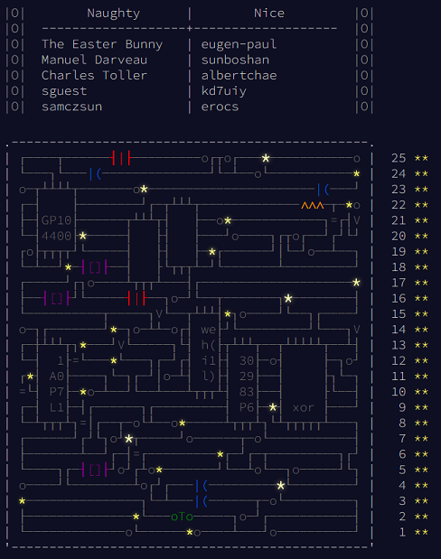
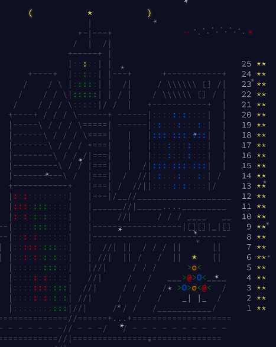
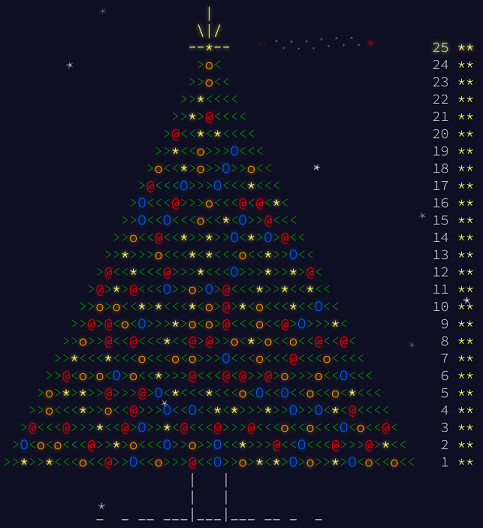

# Adventofcode
My Java-solutions for [Advent of Code](https://adventofcode.com/).

One folder for each year. One folder for each event. Resource folder contains my input for the events.

## Progress:

[Solutions 2018 - 0/0⭐ (comming)](src/main/java/net/eugenpaul/adventofcode/y2018)

[Solutions 2017 - **50/50**⭐ ](src/main/java/net/eugenpaul/adventofcode/y2017)

[Solutions 2016 - **50/50**⭐](src/main/java/net/eugenpaul/adventofcode/y2016)

[Solutions 2015 - **50/50**⭐](src/main/java/net/eugenpaul/adventofcode/y2015) 

