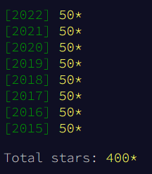

# Adventofcode

My Java-solutions for [Advent of Code](https://adventofcode.com/).

One folder for each year. One folder for each event. Resource folder contains my input for the events.

## Progress

[Solutions 2024 - **16/50**⭐](src/main/java/net/eugenpaul/adventofcode/y2024)

[Solutions 2023 - **50/50**⭐](src/main/java/net/eugenpaul/adventofcode/y2023)

[Solutions 2022 - **50/50**⭐](src/main/java/net/eugenpaul/adventofcode/y2022)

[Solutions 2021 - **50/50**⭐](src/main/java/net/eugenpaul/adventofcode/y2021)

[Solutions 2020 - **50/50**⭐](src/main/java/net/eugenpaul/adventofcode/y2020)

[Solutions 2019 - **50/50**⭐](src/main/java/net/eugenpaul/adventofcode/y2019)

[Solutions 2018 - **50/50**⭐](src/main/java/net/eugenpaul/adventofcode/y2018)

[Solutions 2017 - **50/50**⭐](src/main/java/net/eugenpaul/adventofcode/y2017)

[Solutions 2016 - **50/50**⭐](src/main/java/net/eugenpaul/adventofcode/y2016)

[Solutions 2015 - **50/50**⭐](src/main/java/net/eugenpaul/adventofcode/y2015)

