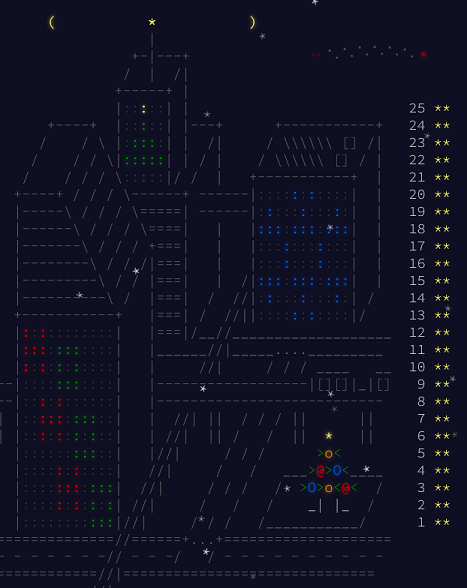

# Solutions

## Progress: Year 2016 [50/50]

| Day  | Status | Link |
| --- | --- | --- |
| 1  | ⭐⭐  | [Day 1: No Time for a Taxicab](day1) |
| 2  | ⭐⭐  | [Day 2: Bathroom Security](day2) |
| 3  | ⭐⭐  | [Day 3: Squares With Three Sides](day3) |
| 4  | ⭐⭐  | [Day 4: Security Through Obscurity](day4) |
| 5  | ⭐⭐  | [Day 5: How About a Nice Game of Chess?](day5) |
| 6  | ⭐⭐  | [Day 6: Signals and Noise](day6) |
| 7  | ⭐⭐  | [Day 7: Internet Protocol Version 7](day7) |
| 8  | ⭐⭐  | [Day 8: Two-Factor Authentication](day8) |
| 9  | ⭐⭐  | [Day 9: Explosives in Cyberspace](day9) |
| 10 | ⭐⭐  | [Day 10: Balance Bots](day10) |
| 11 | ⭐⭐  | [Day 11: Radioisotope Thermoelectric Generators](day11) |
| 12 | ⭐⭐  | [Day 12: Leonardo's Monorail](day12) |
| 13 | ⭐⭐  | [Day 13: A Maze of Twisty Little Cubicles](day13) |
| 14 | ⭐⭐  | [Day 14: One-Time Pad](day14) |
| 15 | ⭐⭐  | [Day 15: Timing is Everything](day15) |
| 16 | ⭐⭐  | [Day 16: Dragon Checksum](day16) |
| 17 | ⭐⭐  | [Day 17: Two Steps Forward](day17) |
| 18 | ⭐⭐  | [Day 18: Like a Rogue](day18) |
| 19 | ⭐⭐  | [Day 19: An Elephant Named Joseph](day19) |
| 20 | ⭐⭐  | [Day 20: Firewall Rules](day20) |
| 21 | ⭐⭐  | [Day 21: Scrambled Letters and Hash](day21) |
| 22 | ⭐⭐  | [Day 22: Grid Computing](day22) |
| 23 | ⭐⭐  | [Day 23: Safe Cracking](day23) |
| 24 | ⭐⭐  | [Day 24: Air Duct Spelunking](day24) |
| 25 | ⭐⭐  | [Day 25: Clock Signal](day25) |

