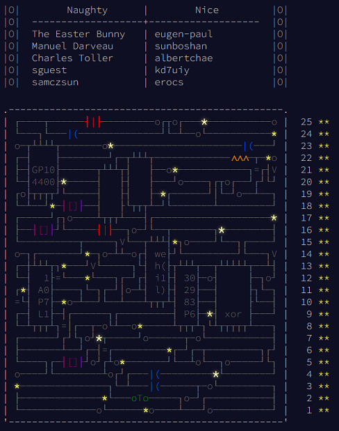

# Solutions

## Progress: Year 2017 [50/50]

| Day  | Status | Link |
| --- | --- | --- |
| 1  | ⭐⭐ | [Day 1: No Time for a Taxicab](day1) |
| 2  | ⭐⭐ | [Day 2: Corruption Checksum](day2) |
| 3  | ⭐⭐ | [Day 3: Spiral Memory](day3) |
| 4  | ⭐⭐ | [Day 4: High-Entropy Passphrases](day4) |
| 5  | ⭐⭐ | [Day 5: A Maze of Twisty Trampolines, All Alike](day5) |
| 6  | ⭐⭐ | [Day 6: Memory Reallocation](day6) |
| 7  | ⭐⭐ | [Day 7: Recursive Circus](day7) |
| 8  | ⭐⭐ | [Day 8: I Heard You Like Registers](day8) |
| 9  | ⭐⭐ | [Day 9: Stream Processing](day9) |
| 10 | ⭐⭐ | [Day 10: Knot Hash](day10) |
| 11 | ⭐⭐ | [Day 11: Hex Ed](day11) |
| 12 | ⭐⭐ | [Day 12: Digital Plumber](day12) |
| 13 | ⭐⭐ | [Day 13: Packet Scanners](day13) |
| 14 | ⭐⭐ | [Day 14: Disk Defragmentation](day14) |
| 15 | ⭐⭐ | [Day 15: Dueling Generators](day15) |
| 16 | ⭐⭐ | [Day 16: Permutation Promenade](day16) |
| 17 | ⭐⭐ | [Day 17: Spinlock](day17) |
| 18 | ⭐⭐ | [Day 18: Duet](day18) |
| 19 | ⭐⭐ | [Day 19: A Series of Tubes](day19) |
| 20 | ⭐⭐ | [Day 20: Particle Swarm](day20) |
| 21 | ⭐⭐ | [Day 21: Fractal Art](day21) |
| 22 | ⭐⭐ | [Day 22: Sporifica Virus](day22) |
| 23 | ⭐⭐ | [Day 23: Coprocessor Conflagration](day23) |
| 24 | ⭐⭐ | [Day 24: Electromagnetic Moat](day24) |
| 25 | ⭐⭐ | [Day 25: The Halting Problem](day25) |

