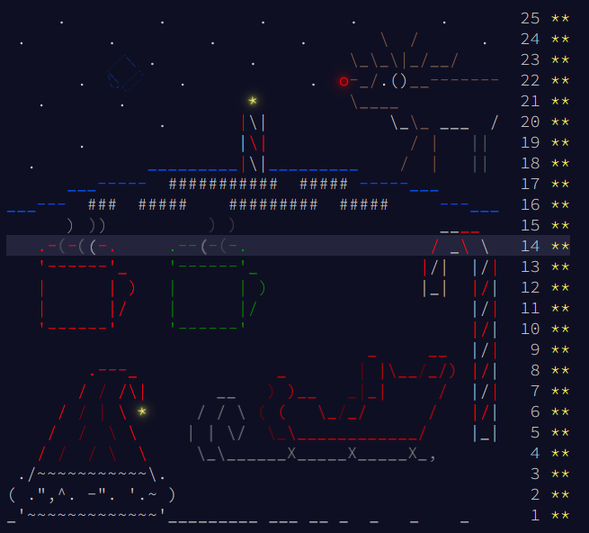

# Solutions

## Progress: Year 2018 [50/50]

| Day  | Status | Link |
| --- | --- | --- |
| 1  | ⭐⭐ | [Day 1: Chronal Calibration](day1) |
| 2  | ⭐⭐ | [Day 2: Inventory Management System](day2) |
| 3  | ⭐⭐ | [Day 3: No Matter How You Slice It](day3) |
| 4  | ⭐⭐ | [Day 4: Repose Record](day4) |
| 5  | ⭐⭐ | [Day 5: Alchemical Reduction](day5) |
| 6  | ⭐⭐ | [Day 6: Chronal Coordinates](day6) |
| 7  | ⭐⭐ | [Day 7: The Sum of Its Parts](day7) |
| 8  | ⭐⭐ | [Day 8: Memory Maneuver](day8) |
| 9  | ⭐⭐ | [Day 9: Marble Mania](day9) |
| 10 | ⭐⭐ | [Day 10: The Stars Align](day10) |
| 11 | ⭐⭐ | [Day 11: Chronal Charge](day11) |
| 12 | ⭐⭐ | [Day 12: Subterranean Sustainability](day12) |
| 13 | ⭐⭐ | [Day 13: Mine Cart Madness](day13) |
| 14 | ⭐⭐ | [Day 14: Chocolate Charts](day14) |
| 15 | ⭐⭐ | [Day 15: Beverage Bandits](day15) |
| 16 | ⭐⭐ | [Day 16: Chronal Classification](day16) |
| 17 | ⭐⭐ | [Day 17: Reservoir Research](day17) |
| 18 | ⭐⭐ | [Day 18: Settlers of The North Pole](day18) |
| 19 | ⭐⭐ | [Day 19: Go With The Flow](day19) |
| 20 | ⭐⭐ | [Day 20: A Regular Map](day20) |
| 21 | ⭐⭐ | [Day 21: Chronal Conversion](day21) |
| 22 | ⭐⭐ | [Day 22: Mode Maze](day22) |
| 23 | ⭐⭐ | [Day 23: Experimental Emergency Teleportation](day23) |
| 24 | ⭐⭐ | [Day 24: Immune System Simulator 20XX](day24) |
| 25 | ⭐⭐ | [Day 25: Four-Dimensional Adventure](day25) |

