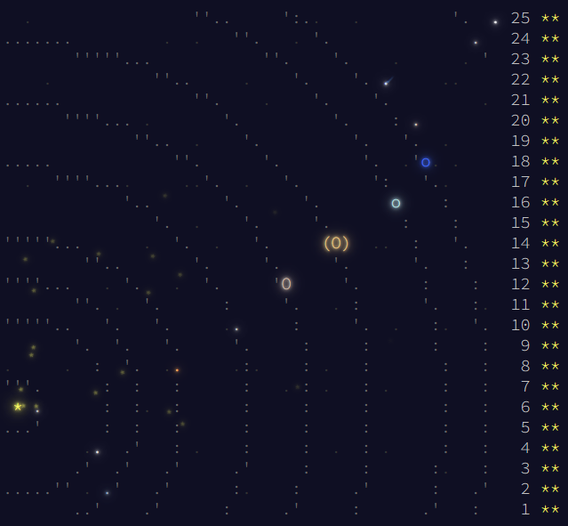

# Solutions

## Progress: Year 2019 [50/50]

| Day  | Status | Link |
| --- | --- | --- |
| 1  | ⭐⭐ | [Day 1: The Tyranny of the Rocket Equation](day1) |
| 2  | ⭐⭐ | [Day 2: 1202 Program Alarm](day2) |
| 3  | ⭐⭐ | [Day 3: Crossed Wires](day3) |
| 4  | ⭐⭐ | [Day 4: Secure Container](day4) |
| 5  | ⭐⭐ | [Day 5: Sunny with a Chance of Asteroids](day5) |
| 6  | ⭐⭐ | [Day 6: Universal Orbit Map](day6) |
| 7  | ⭐⭐ | [Day 7: Amplification Circuit](day7) |
| 8  | ⭐⭐ | [Day 8: Space Image Format](day8) |
| 9  | ⭐⭐ | [Day 9: Sensor Boost](day9) |
| 10 | ⭐⭐ | [Day 10: Monitoring Station](day10) |
| 11 | ⭐⭐ | [Day 11: Space Police](day11) |
| 12 | ⭐⭐ | [Day 12: The N-Body Problem](day12) |
| 13 | ⭐⭐ | [Day 13: Care Package](day13) |
| 14 | ⭐⭐ | [Day 14: Space Stoichiometry](day14) |
| 15 | ⭐⭐ | [Day 15: Oxygen System](day15) |
| 16 | ⭐⭐ | [Day 16: Flawed Frequency Transmission](day16) |
| 17 | ⭐⭐ | [Day 17: Set and Forget](day17) |
| 18 | ⭐⭐ | [Day 18: Many-Worlds Interpretation](day18) |
| 19 | ⭐⭐ | [Day 19: Tractor Beam](day19) |
| 20 | ⭐⭐ | [Day 20: Donut Maze](day20) |
| 21 | ⭐⭐ | [Day 21: Springdroid Adventure](day21) |
| 22 | ⭐⭐ | [Day 22: Slam Shuffle](day22) |
| 23 | ⭐⭐ | [Day 23: Category Six](day23) |
| 24 | ⭐⭐ | [Day 24: Planet of Discord](day24) |
| 25 | ⭐⭐ | [Day 25: Cryostasis](day25) |

