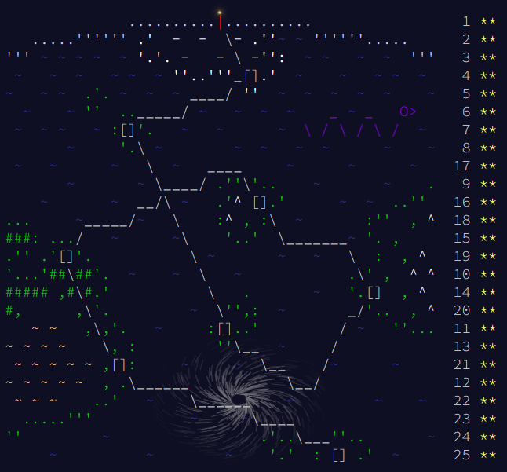

# Solutions

## Progress: Year 2020 [50/50]

| Day  | Status | Link |
| --- | --- | --- |
| 1  | ⭐⭐ | [Day 1: Report Repair](day1) |
| 2  | ⭐⭐ | [Day 2: Password Philosophy](day2) |
| 3  | ⭐⭐ | [Day 3: Toboggan Trajectory](day3) |
| 4  | ⭐⭐ | [Day 4: Passport Processing](day4) |
| 5  | ⭐⭐ | [Day 5: Binary Boarding](day5) |
| 6  | ⭐⭐ | [Day 6: Custom Customs](day6) |
| 7  | ⭐⭐ | [Day 7: Handy Haversacks](day7) |
| 8  | ⭐⭐ | [Day 8: Handheld Halting](day8) |
| 9  | ⭐⭐ | [Day 9: Encoding Error](day9) |
| 10 | ⭐⭐ | [Day 10: Adapter Array](day10) |
| 11 | ⭐⭐ | [Day 11: Seating System](day11) |
| 12 | ⭐⭐ | [Day 12: Rain Risk](day12) |
| 13 | ⭐⭐ | [Day 13: Shuttle Search](day13) |
| 14 | ⭐⭐ | [Day 14: Docking Data](day14) |
| 15 | ⭐⭐ | [Day 15: Rambunctious Recitation](day15) |
| 16 | ⭐⭐ | [Day 16: Ticket Translation](day16) |
| 17 | ⭐⭐ | [Day 17: Conway Cubes](day17) |
| 18 | ⭐⭐ | [Day 18: Operation Order](day18) |
| 19 | ⭐⭐ | [Day 19: Monster Messages](day19) |
| 20 | ⭐⭐ | [Day 20: Jurassic Jigsaw](day20) |
| 21 | ⭐⭐ | [Day 21: Allergen Assessment](day21) |
| 22 | ⭐⭐ | [Day 22: Crab Combat](day22) |
| 23 | ⭐⭐ | [Day 23: Crab Cups](day23) |
| 24 | ⭐⭐ | [Day 24: Lobby Layout](day24) |
| 25 | ⭐⭐ | [Day 25: Combo Breaker](day25) |

