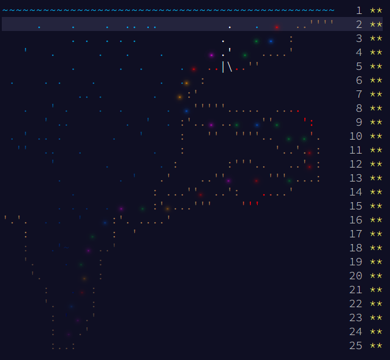

# Solutions

## Progress: Year 2021 [50/50]

| Day  | Status | Link |
| --- | --- | --- |
| 1  | ⭐⭐ | [Day 1: Sonar Sweep](day1) |
| 2  | ⭐⭐ | [Day 2: Dive!](day2) |
| 3  | ⭐⭐ | [Day 3: Binary Diagnostic](day3) |
| 4  | ⭐⭐ | [Day 4: Giant Squid](day4) |
| 5  | ⭐⭐ | [Day 5: Hydrothermal Venture](day5) |
| 6  | ⭐⭐ | [Day 6: Lanternfish](day6) |
| 7  | ⭐⭐ | [Day 7: The Treachery of Whales](day7) |
| 8  | ⭐⭐ | [Day 8: Seven Segment Search](day8) |
| 9  | ⭐⭐ | [Day 9: Smoke Basin](day9) |
| 10 | ⭐⭐ | [Day 10: Syntax Scoring](day10) |
| 11 | ⭐⭐ | [Day 11: Dumbo Octopus](day11) |
| 12 | ⭐⭐ | [Day 12: Passage Pathing](day12) |
| 13 | ⭐⭐ | [Day 13: Transparent Origami](day13) |
| 14 | ⭐⭐ | [Day 14: Extended Polymerization](day14) |
| 15 | ⭐⭐ | [Day 15: Chiton](day15) |
| 16 | ⭐⭐ | [Day 16: Packet Decoder](day16) |
| 17 | ⭐⭐ | [Day 17: Trick Shot](day17) |
| 18 | ⭐⭐ | [Day 18: Snailfish](day18) |
| 19 | ⭐⭐ | [Day 19: Beacon Scanner](day19) |
| 20 | ⭐⭐ | [Day 20: Trench Map](day20) |
| 21 | ⭐⭐ | [Day 21: Dirac Dice](day21) |
| 22 | ⭐⭐ | [Day 22: Reactor Reboot](day22) |
| 23 | ⭐⭐ | [Day 23: Amphipod](day23) |
| 24 | ⭐⭐ | [Day 24: Arithmetic Logic Unit](day24) |
| 25 | ⭐⭐ | [Day 25: Sea Cucumber](day25) |

